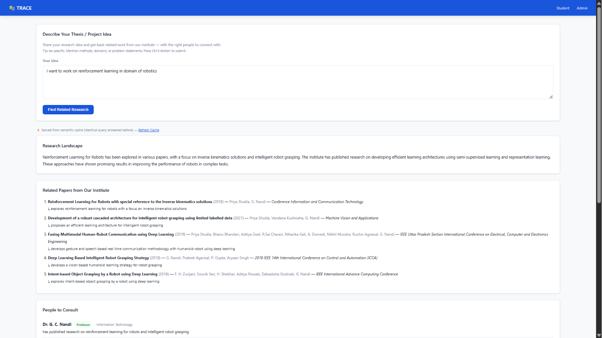
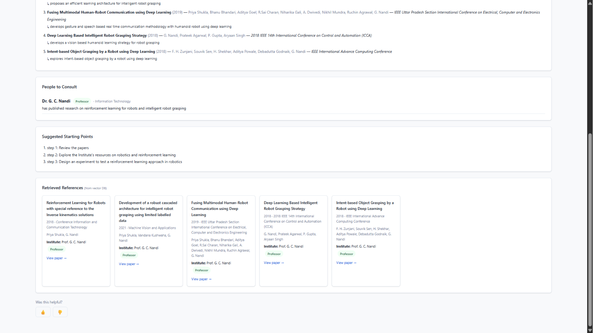
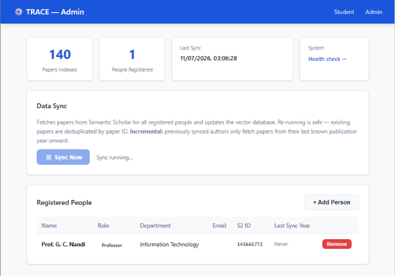

# TRACE

**Trustworthy Retrieval with Automated Continuous Evaluation**

A self-hosted RAG (Retrieval-Augmented Generation) system that helps students discover related research within their institute. Students describe a thesis or project idea in plain language and receive fully-attributed guidance: relevant papers, faculty to consult, and suggested next steps — all grounded exclusively in real institute publications pulled from Semantic Scholar.

TRACE ships with a full LLMOps evaluation stack: RAGAS per-query scoring, DeepEval regression tests, MLflow experiment tracking, TruLens monitoring, and an automated self-retrieval sanity check after every sync.

---

## Quick Start

### Prerequisites

| Requirement | Version | Notes |
|---|---|---|
| Python | 3.10+ | 3.13 tested |
| [Ollama](https://ollama.ai) | Latest | Must be running before server start |
| Ollama model | `llama3.2` | `ollama pull llama3.2` |

### 1. Clone and Install

```bash
git clone <repo-url> trace
cd trace
python3 -m venv venv && source venv/bin/activate
pip install -r requirements.txt
```

### 2. Set Required Environment Variables

The server refuses to start without these two variables:

```bash
export ADMIN_PASSWORD="your-strong-password"
export CORS_ORIGINS="http://localhost:8000"
```

For development, `CORS_ORIGINS="*"` is acceptable. In production, set it to your institute's domain.

### 3. Start

```bash
cd backend
uvicorn main:app --reload --host 0.0.0.0 --port 8000
```

### 4. First-Time Setup

1. Open `http://localhost:8000/admin`
2. Search for faculty/students by name using the Semantic Scholar widget and add them
3. Click **Sync Now** — wait for the progress badge to show `done`
4. Go to `http://localhost:8000/` and submit a test query

---

## Screenshots & UI Overview

### Student Interface (`/`)



The student page is a single-input form. Students type a research idea in natural language and receive:

- **Landscape summary** — 2–3 sentences situating the idea within existing institute work
- **Related papers** — titles, authors, years, venues, and a relevance note
- **People to consult** — faculty and students whose work is most relevant, with department and role
- **Next steps** — concrete suggestions for moving the idea forward
- **Thumbs feedback** — up/down rating and optional comment

### Admin Interface (`/admin`)


The admin panel is a password-protected dashboard for managing data:

- **People registry** — add/remove faculty and students by searching Semantic Scholar
- **Sync status** — live progress indicator for the ingestion pipeline; shows per-person paper counts
- **Stats** — total papers indexed, people registered, last sync time
- **Health** — ChromaDB and Ollama subsystem status

---

## Architecture Overview

```
                     ┌──────────────────────────────────────────┐
                     │             FastAPI Backend               │
  Student ──────────▶│  /api/query  (rate-limited: 10/min/IP)   │
  Admin ────────────▶│  /api/*      (X-Admin-Password header)    │
                     └──────────┬───────────────────────────────┘
                                │
              ┌─────────────────┼─────────────────────┐
              │                 │                     │
              ▼                 ▼                     ▼
   ┌──────────────────┐  ┌────────────┐  ┌──────────────────────┐
   │  ChromaDB        │  │  Ollama    │  │  Semantic Scholar     │
   │  (HNSW index)    │  │  llama3.2  │  │  Graph API           │
   │  + query cache   │  │  + embeds  │  │  (ingestion only)    │
   └──────────────────┘  └────────────┘  └──────────────────────┘
```

### Query Pipeline (8 Stages)

```
Embed query → Semantic cache check
                    ↓ MISS
Query expansion via LLM
                    ↓
HNSW vector search (k=20)
                    ↓
Similarity threshold guard (distance ≤ 0.85)
                    ↓
BM25 search + Reciprocal Rank Fusion
                    ↓
Cross-encoder reranking (top 5 of 20)
                    ↓
LLM structured JSON generation
                    ↓
Write to semantic cache → return
```

Cache hits return in ~7 ms. Full pipeline runs in ~10–30 s (dominated by LLM generation).

---

## Repository Structure

```
trace/
├── backend/
│   ├── main.py                   FastAPI application — routes, auth, middleware
│   ├── config.py                 All env-var settings + startup validation
│   ├── llm_provider.py           Singleton factory for LLM, embeddings, JSON-LLM
│   │
│   ├── ingestion/
│   │   ├── ingestor.py           Sync pipeline: Scholar API → ChromaDB
│   │   ├── scholar_client.py     Semantic Scholar client (retry, rate-limit backoff)
│   │   └── people_registry.py    CRUD over data/people.json with file locking
│   │
│   ├── rag/
│   │   ├── pipeline.py           Full 8-stage query orchestration
│   │   ├── chain.py              LLM call, JSON parsing, hallucination guard
│   │   ├── vector_store.py       ChromaDB wrapper (HNSW-tuned, corruption detection)
│   │   ├── hybrid_search.py      BM25 index + RRF fusion
│   │   ├── reranker.py           Cross-encoder reranking
│   │   └── semantic_cache.py     Query-level cache (ChromaDB collection)
│   │
│   ├── eval/
│   │   ├── ragas_scorer.py       Live RAGAS scoring (opt-in via ENABLE_RAGAS_SCORING)
│   │   ├── analyse_feedback.py   Feedback log analysis (also via /api/feedback/analysis)
│   │   ├── self_retrieval.py     Embedding sanity check (auto-runs post-sync)
│   │   ├── run_eval.py           Full eval set runner → MLflow
│   │   ├── deepeval_config.py    Local judge for DeepEval regression tests
│   │   └── test_rag_regression.py  pytest regression suite
│   │
│   └── data/                     Runtime data (git-ignored)
│       ├── people.json           Faculty/student registry
│       ├── sync_status.json      Incremental sync state (atomic writes)
│       ├── feedback.jsonl        User ratings + optional RAGAS scores
│       ├── eval_set.json         Annotated ground truth (create manually)
│       └── chroma_db/            Persistent vector index
│
├── frontend/
│   ├── index.html                Student query page (vanilla JS, no build step)
│   ├── admin.html                Admin dashboard (vanilla JS, no build step)
│   └── static/
│       └── style.css             Shared stylesheet
│
├── docs/
│   ├── developer-guide.md        Architecture, design decisions, full API reference
│   ├── llmops-evaluation.md      RAGAS, DeepEval, MLflow, TruLens evaluation guide
│   └── feature-upgrades.md       Remaining enhancements and engineering backlog
│
├── requirements.txt
└── README.md                     This file
```

---

## Configuration

The server validates all config on startup. Mismatches raise a `ValueError` with a descriptive message.

### Required (no defaults — server will not start without these)

| Variable | Example | Purpose |
|---|---|---|
| `ADMIN_PASSWORD` | `"letmein-strong-42"` | Admin panel and all `/api/*` admin routes |
| `CORS_ORIGINS` | `"https://institute.edu"` or `"*"` | Comma-separated list of allowed browser origins |

### Optional (have defaults)

| Variable | Default | Purpose |
|---|---|---|
| `INSTITUTE_NAME` | `"Our Institute"` | Appears in LLM prompt and page title |
| `LLM_MODEL_NAME` | `"llama3.2"` | Ollama model used for generation and query expansion |
| `EMBEDDING_MODEL_NAME` | `"all-MiniLM-L6-v2"` | HuggingFace bi-encoder for vector search |
| `RERANKER_MODEL_NAME` | `"cross-encoder/ms-marco-MiniLM-L-6-v2"` | Cross-encoder for reranking |
| `OLLAMA_BASE_URL` | `"http://localhost:11434"` | Ollama API base URL |
| `OLLAMA_KEEP_ALIVE` | `-1` | `-1` = keep model in VRAM forever (KV-cache benefit) |
| `OLLAMA_NUM_CTX` | `8192` | Context window in tokens |
| `RETRIEVAL_FETCH_K` | `20` | Candidates retrieved before reranking |
| `RETRIEVAL_K` | `5` | Final results after reranking |
| `MIN_SIMILARITY_DISTANCE` | `0.85` | Cosine distance above which results are discarded |
| `CACHE_HIT_DISTANCE` | `0.08` | Below this distance, a cached answer is returned |
| `RECENCY_WEIGHT` | `0.01` | RRF score bonus per year of recency |
| `RATE_LIMIT_QUERIES` | `"10/minute"` | Per-IP rate limit on `/api/query` |
| `SEMANTIC_SCHOLAR_API_KEY` | `""` | Optional S2 key: raises limit from 100/5min to 10/s |
| `ENABLE_RAGAS_SCORING` | `"false"` | Set `"true"` to score every query with RAGAS |

---

## API Reference

### Student Endpoints (no auth)

| Method | Path | Description |
|---|---|---|
| `GET` | `/` | Student query page |
| `POST` | `/api/query` | `{"idea": "..."}` → `{answer, sources, cached}` |
| `POST` | `/api/feedback` | `{"query", "rating": "up"\|"down", "comment"}` → `{ok}` |

### Admin Endpoints (`X-Admin-Password: <password>` required)

| Method | Path | Description |
|---|---|---|
| `GET` | `/admin` | Admin panel |
| `GET` | `/health` | Subsystem health: chromadb, ollama |
| `GET` | `/api/people` | List registered people (`?page=1&page_size=100`) |
| `POST` | `/api/people` | Add a person |
| `DELETE` | `/api/people/{id}` | Remove a person and clean up their papers |
| `POST` | `/api/sync` | Trigger incremental sync (background task) |
| `GET` | `/api/sync/status` | Live sync progress |
| `GET` | `/api/stats` | Papers indexed, people, last sync timestamp |
| `GET` | `/api/feedback/analysis` | Feedback trends: thumbs-down rate, RAGAS scores |
| `POST` | `/api/author/search` | `{"name": "..."}` → Semantic Scholar author search |
| `GET` | `/docs` | Auto-generated OpenAPI interactive docs |

---

## Backend State (Current)

### What's Implemented and Stable

| Component | File | Status |
|---|---|---|
| 8-stage RAG pipeline | `rag/pipeline.py` | Stable |
| HNSW vector store | `rag/vector_store.py` | Stable, corruption detection added |
| BM25 + RRF hybrid search | `rag/hybrid_search.py` | Stable |
| Cross-encoder reranker | `rag/reranker.py` | Stable |
| Semantic query cache | `rag/semantic_cache.py` | Stable, no-results now cached |
| LLM chain + hallucination guard | `rag/chain.py` | Stable, guard threshold raised to 0.75 |
| Incremental sync | `ingestion/ingestor.py` | Stable, atomic writes, year=0 fix |
| Semantic Scholar client | `ingestion/scholar_client.py` | Stable, retry with context-aware 429 errors |
| People registry | `ingestion/people_registry.py` | Stable, file-locked |
| Config validation | `config.py` | Validates on startup |
| Admin auth | `main.py` | `hmac.compare_digest`, required env var |
| CORS | `main.py` | Env-var configured, no unsafe defaults |
| Rate limiting | `main.py` | slowapi, per-IP |
| Health check | `main.py` | ChromaDB + Ollama, timeout-aware |
| RAGAS integration | `eval/ragas_scorer.py` | Opt-in via `ENABLE_RAGAS_SCORING=true` |
| Self-retrieval test | `eval/self_retrieval.py` | Auto-runs post-sync |
| Feedback analysis API | `main.py` + `eval/analyse_feedback.py` | `GET /api/feedback/analysis` |
| DeepEval regression tests | `eval/test_rag_regression.py` | Run with `pytest eval/` |
| MLflow eval runner | `eval/run_eval.py` | Requires `data/eval_set.json` |

### Known Issues / In-Progress

| Issue | Location | Severity |
|---|---|---|
| No per-user API keys — single shared password | `config.py`, `main.py` | High |
| Sync degraded status not surfaced in UI | `ingestor.py`, `admin.html` | Medium |
| No rate limit on admin endpoints | `main.py` | Medium |
| Metadata not schema-validated (bare dicts) | `ingestor.py`, `rag/vector_store.py` | Medium |
| Cache entries never expire by age | `rag/semantic_cache.py` | Low |
| No concurrent sync lock (multi-worker) | `ingestor.py` | Low |

See [docs/feature-upgrades.md](docs/feature-upgrades.md) for the full backlog.

---

## Frontend State (Current)

### `frontend/index.html` — Student Query Page

**Status: Stable, vanilla JS, no build step**

Features:
- Single-input query form
- Displays landscape summary, papers, people, next steps
- Shows `cached: true` indicator when a cache hit is returned
- Thumbs-up/down feedback widget with optional comment
- Error states: empty input, 429 rate-limit, 503 Ollama unavailable, 500 server error

Known gaps:
- No query history within session
- No dark mode
- Feedback submission does not animate

### `frontend/admin.html` — Admin Dashboard

**Status: Stable, vanilla JS, no build step**

Features:
- Login gate (password stored in `sessionStorage` for the session only)
- People registry: add by name search, remove with confirmation
- Semantic Scholar author search widget
- Sync trigger + live status polling
- Stats panel (total papers, people, last sync)
- Health check display

Known gaps:
- Sync errors not shown (API returns them, UI does not render them)
- No feedback analysis dashboard (available via API, not wired in UI)
- No dark mode

### `frontend/static/style.css`

**Status: Stable, single shared stylesheet**

- Responsive layout (mobile-friendly)
- No build step required — no SASS, no PostCSS
- No dark mode support

---

## Development Notes

### Running the Eval Suite

```bash
cd backend
# Self-retrieval sanity check (requires at least 1 sync)
python eval/self_retrieval.py

# Full eval set against ground truth + MLflow logging
python eval/run_eval.py --run-name "baseline"
mlflow ui --backend-store-uri data/mlruns

# Regression test suite
python -m pytest eval/test_rag_regression.py -v

# Feedback analysis
python eval/analyse_feedback.py
# or via API:
curl -H "X-Admin-Password: yourpassword" http://localhost:8000/api/feedback/analysis
```

### Changing the Embedding Model

```bash
# 1. Update config
export EMBEDDING_MODEL_NAME="BAAI/bge-small-en-v1.5"

# 2. Delete old index (vectors are incompatible between models)
rm -rf backend/data/chroma_db backend/data/chroma_meta.json

# 3. Restart and re-sync
uvicorn main:app ...
# POST /api/sync via admin panel
```

If you skip step 2, the startup guard reads `chroma_meta.json` and raises a clear `RuntimeError` describing the mismatch.

### Swapping the LLM

```bash
# Pull the new model
ollama pull llama3.1:8b

# Set env var and restart
LLM_MODEL_NAME=llama3.1:8b ADMIN_PASSWORD=secret CORS_ORIGINS=* uvicorn main:app --reload
```

No code changes required — the LLM swap is fully config-driven.

### Debugging a Poor Query Result

1. Check `/health` — ensure both `chromadb` and `ollama` are `"ok"`
2. Check logs for `"event": "query"` — look at `retrieved` count and `top_rerank_score`
3. If `retrieved: 0`, lower `MIN_SIMILARITY_DISTANCE` (try 0.95)
4. If top score is low (<0.3), try rephrasing the query or expanding the BM25 index
5. If the answer cites wrong papers, check the hallucination guard log for `Hallucination dropped:`
6. Run `python eval/self_retrieval.py` to verify the embedding index is intact

---

## Deployment Checklist

Before going to production:

- [ ] Set `ADMIN_PASSWORD` to a strong, unique value
- [ ] Set `CORS_ORIGINS` to your institute's actual domain (not `*`)
- [ ] Set `INSTITUTE_NAME` to your institute's name
- [ ] Run `ollama pull llama3.2` on the production server
- [ ] Run at least one sync and verify paper count > 0
- [ ] Confirm `/health` returns `"status": "ok"` for all subsystems
- [ ] Run `python eval/self_retrieval.py` and verify `PASS`
- [ ] Test a student query end-to-end
- [ ] Set up a weekly cron job for sync: `curl -X POST .../api/sync -H "X-Admin-Password: ..."`
- [ ] Consider `ENABLE_RAGAS_SCORING=true` for continuous quality monitoring
- [ ] Restrict Ollama to `localhost` only if running on a shared server

---

## Documentation

| Document | Description |
|---|---|
| [docs/developer-guide.md](docs/developer-guide.md) | Full architecture reference, design decisions, API docs, evaluation strategy |
| [docs/llmops-evaluation.md](docs/llmops-evaluation.md) | RAGAS, DeepEval, MLflow, TruLens — complete evaluation framework guide |
| [docs/feature-upgrades.md](docs/feature-upgrades.md) | Remaining feature backlog with implementation notes and effort estimates |
