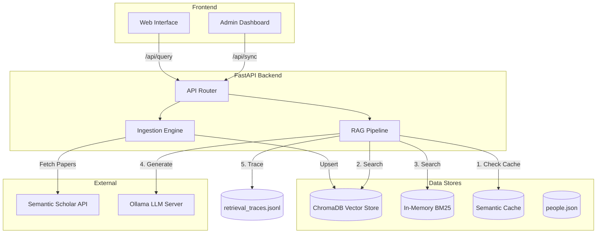

# Architecture & System Design

TRACE (Trustworthy Retrieval with Automated Continuous Evaluation) is a robust Retrieval-Augmented Generation (RAG) system built around FastAPI, ChromaDB, and local LLMs.

## High-Level Architecture

## System Components

### 1. The RAG Pipeline (`backend/rag/pipeline.py`)
The query pipeline operates in a non-blocking thread executor to keep the async event loop free:
1. **Semantic Cache Check**: If the query's vector embedding distance is `< 0.08` to a recent query (within the 15-day TTL), the cached JSON is returned immediately.
2. **Hybrid Retrieval**: Combines sparse BM25 retrieval (keyword matching) with dense ChromaDB retrieval (semantic matching), fused with weighted RRF. `RETRIEVAL_MODE` selects `dense`, `bm25` or `hybrid` so each arm's contribution can be measured.
3. **Similarity Guard**: applied to dense candidates before fusion, then re-applied to BM25-only candidates afterwards — otherwise the guard is bypassed entirely by the sparse arm.
4. **Cross-Encoder Reranking**: Re-scores the retrieved documents to surface the most relevant papers to the top. If the model cannot load, the fallback to fusion order is reported in `/health` and tagged in every trace rather than passing silently.
5. **LLM Generation**: Uses local models via Ollama. It enforces a strict JSON schema and employs a hallucination guard that cross-references `paper_id`s **and author names**, so neither fabricated citations nor fabricated people reach the student.
6. **Tracing**: one record per query capturing the candidate set at each stage, per-stage latency, grounding counts and the config snapshot. This is the substrate every offline metric is computed from.

### 2. Ingestion Engine (`backend/ingestion/ingestor.py`)
Fetches and maintains a local database of papers authored by registered institute members. It performs incremental fetching from the Semantic Scholar Graph API and strictly validates metadata using Pydantic before upserting embeddings into ChromaDB.

### 3. Observability (`backend/rag/trace.py`)
Every query writes a JSON record to `data/retrieval_traces.jsonl`, keyed by a `query_id` that is returned to the browser and echoed back with user feedback. This is what makes a thumbs-down attributable to a cache hit, an empty result set or a genuine ranking miss, rather than only to the query text. `retrieval_ms` is tracked separately from total latency, since generation dominates the total and would otherwise hide every retrieval change.

### 4. State & Persistence
- **ChromaDB**: Persists embeddings and metadata to disk (`data/chroma_db`).
- **People Registry**: Uses `portalocker` for thread-safe file access to `data/people.json`.
- **Sync Status**: Maintained in `data/sync_status.json` and locked during operations to prevent multi-worker concurrency corruption.
